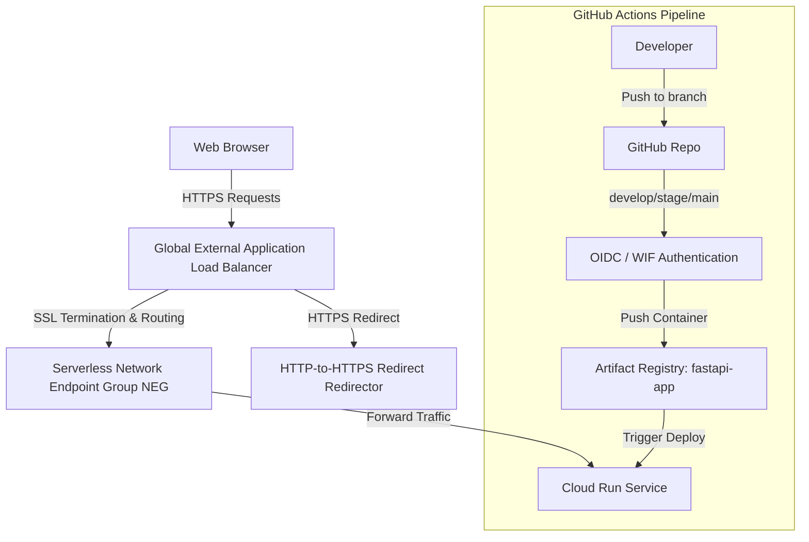

# FastAPI Multi-Environment GCP Cloud Run Deployment & Custom Domain Guide

This repository is configured with a fully automated, professional CI/CD pipeline that deploys a FastAPI application to **Google Cloud Run** across multiple environments using secure, passwordless **OIDC (OpenID Connect) / Workload Identity Federation**.

It also documents the process of mapping custom subdomains to these Cloud Run environments using a secure, high-performance **Global External Application Load Balancer**.

---

## 🚀 Architecture Overview



---

## 🛠️ Environments Mapping

The GitHub Actions workflow dynamically targets the correct GCP Cloud Run environment based on the branch being pushed:

| Branch Name | GitHub Environment | Target Cloud Run Service | Description |
| :--- | :--- | :--- | :--- |
| `develop` | `development` | `fastapi-dev` | Sandboxed development & testing environment |
| `stage` | `staging` | `fastapi-stage` | Pre-production testing environment |
| `main` | `production` | `fastapi-prod` | Live production application |

---

## 🌐 Custom Domain & Application Load Balancer Setup

To set up custom subdomains (e.g. `dev.theashish.space` or `api.theashish.space`) with Cloud Run, Google recommends using an **External Application Load Balancer**. This enables edge caching, custom domains, and Google-managed SSL certificates.

We offer two ways to set this up: an **automated shell script** or **manual console configuration**.

---

### 🔥 Option 1: Automated Script (Recommended)

We have created an interactive provisioning script `scripts/setup-loadbalancer.sh` that automates the creation of all GCP network resources, SSL certificates, Neg backends, and HTTPS redirect proxies.

#### How to run it:
1. Make the script executable:
   ```bash
   chmod +x scripts/setup-loadbalancer.sh
   ```
2. Execute the script:
   ```bash
   ./scripts/setup-loadbalancer.sh
   ```
3. Enter your **GCP Project ID**, target **Cloud Run Service Name** (e.g. `fastapi-dev`), **preferred region** (e.g. `asia-south1`), and your **custom domain** (e.g. `dev.theashish.space`).
4. The script will automatically:
   *   Reserve a static global external IP address.
   *   Provision the Serverless NEG and backend service.
   *   Set up a Google-managed SSL Certificate.
   *   Establish the HTTPS Target Proxy and Forwarding Rule (Port 443).
   *   Configure the HTTP-to-HTTPS redirect URL Map, Target Proxy, and Forwarding Rule (Port 80).
   *   Grant the necessary `run.invoker` role to the default Compute Engine service account.
   *   Print the reserved IP address and DNS A-record mapping instructions.

---

### 💻 Option 2: Manual Console Guide

If you prefer to set up resources manually using the GCP Console, follow this step-by-step process:

#### A. Load Balancer Type
*   Navigate to **GCP Console -> Network Services -> Load Balancing -> Create Load Balancer**.
*   Select **Application Load Balancer (HTTP/HTTPS)**.
*   **Public-facing or Internal**: Select **Public-facing (external)**.
*   **Global or Single Region Deployment**: Select **Best for global workloads**.
*   **Load Balancer Generation**: Select **Global external Application Load Balancer** (new generation).

#### B. Frontend Configuration
*   **Name**: Provide a descriptive name (e.g., `fastapi-global-alb`).
*   **Protocol**: Select `HTTPS` (includes HTTP/2 and HTTP/3).
*   **IP Address**: Create/reserve a static external IP address (e.g., `fastapi-alb-static-ip`).
*   **Certificate**:
    1. Select **Classic Certificates** -> **Create a new certificate**.
    2. Select **Create Google-managed certificate**.
    3. Enter your custom domains (e.g. `dev.theashish.space`).
*   **HTTP to HTTPS Redirect**:
    *   **Check** the **Enable HTTP to HTTPS redirect** checkbox. (This automatically creates a secondary HTTP load balancer to route insecure traffic to HTTPS).
*   Click **Done** to save the frontend configuration.

#### C. Backend Configuration
*   Click on **Backend Configuration** -> **Create a backend service**.
*   **Backend Type**: Select **Serverless Network Endpoint Group**.
*   Under **Backends**:
    1. In the backend dropdown, select **Create Serverless Network Endpoint Group (NEG)**.
    2. Provide a Name (e.g. `fastapi-neg-dev`).
    3. **Region**: Select the region where your Cloud Run service is running (e.g., `asia-south1`).
    4. **Cloud Run**: Select **Cloud Run service**, then choose the target service (e.g. `fastapi-dev`).
    5. Click **Create** to save the Serverless NEG.
*   Save the backend service configuration.

#### D. Routing Rules
*   Under **Routing Rules**, proceed with a **Simple host and path rule** to route all traffic (`*`) to the backend service you created.

#### E. Review & Finalize
*   Proceed to the review screen, confirm your configuration, and click **Create** to start the load balancer provisioning process.
*   *Note*: The console will create both the main HTTPS Load Balancer and the companion HTTP-to-HTTPS redirect load balancer.

---

### 📌 Step 3: Map your Custom Domain DNS to the Load Balancer IP

After your load balancer is successfully created (either via the automated script or the manual GCP console setup), you must point your custom domain/subdomain to the reserved static IP address of the Load Balancer:

#### 1. Find your Load Balancer's Public Static IP:
*   **Via Script**: The `setup-loadbalancer.sh` script prints the IP address at the end of the run.
*   **Via GCP Console**: Navigate to **Network Services -> Load Balancing**. Select your Load Balancer, click **Frontend Configuration**, and copy the IP address listed under the HTTPS rule. (You can also find it under **VPC Network -> IP Addresses**).

#### 2. Configure DNS Records at your Registrar (e.g., GoDaddy, Cloudflare, Namecheap):
Log in to your DNS provider's console and create or update the **A Record** for your custom domain:

| Record Type | Host / Name / Subdomain | Value / Points to | TTL |
| :--- | :--- | :--- | :--- |
| **A** | `dev` (e.g., for `dev.theashish.space`) | `Your Static IP Address` (e.g., `34.120.x.x`) | `600 seconds` or default |

> [!IMPORTANT]
> If you are setting up a root domain (e.g. `theashish.space`), the Host should be `@`. If you are mapping a subdomain, the Host should be the prefix (e.g. `dev`, `stage`, `api`).

---

## 🔒 Security & Invoker Permissions

> [!IMPORTANT]
> If your Cloud Run service initially returns a `403 Forbidden` error when accessed through the Load Balancer, it is likely due to missing invoker permissions on your Default Compute Engine service account.

The Global Application Load Balancer and the Serverless NEG must be authorized to call the Cloud Run service. To resolve this:
*   Grant the **Cloud Run Invoker** (`roles/run.invoker`) role to the **Compute Engine default service account** (`[PROJECT_NUMBER]-compute@developer.gserviceaccount.com`).
*   This is automated in the upgraded `scripts/setup-gcp.sh` and `scripts/setup-loadbalancer.sh` scripts.

---

## ⏳ SSL Certificate Provisioning Warning

> [!WARNING]
> Google-managed SSL Certificates can take **up to 72 hours** to fully provision, validate, and activate.
> During this period, visiting your domain over HTTPS may display an SSL warning in your browser. This is normal. Google is validating your DNS records and issuing the certificate at the edge.

---

## ⚙️ Initial CI/CD Setup Guide (One-Time)

### Step 1: Provision GCP Resources
Execute the automated provisioner script to set up IAM Service Accounts, the Artifact Registry, OIDC, and the `run.invoker` roles:

```bash
chmod +x scripts/gcp/setup-gcp.sh
./scripts/gcp/setup-gcp.sh
```

During this setup, you will be prompted for:
1. **GCP Project ID**
2. **GitHub Repository** in `owner/repo` format
3. **Preferred GCP Region** (Default: `asia-south1`)

Once finished, the script will output the exact configuration parameters needed for your GitHub environment settings.

---

### Step 2: Configure GitHub Repository Environments & GCP Secret Manager
Configure the environment-specific values in GitHub Actions and GCP Secret Manager. Refer to the [ENVIRONMENT_SETUP.md](ENVIRONMENT_SETUP.md) guide for the complete list of variables and secrets required.

---

## 🔄 Deployment Process (Automated)

Once the configurations are in place, the deployment is fully automated:

1. **Develop locally**:
   ```bash
   uvicorn app.main:app --reload
   ```
2. **Deploy to Development**:
   Commit and push changes to the `develop` branch.
   ```bash
   git checkout develop
   git add .
   git commit -m "feat: add new feature"
   git push origin develop
   ```
3. **Promote to Staging**:
   Merge the `develop` branch into the `stage` branch and push.
   ```bash
   git checkout stage
   git merge develop
   git push origin stage
   ```
4. **Release to Production**:
   Merge the `stage` branch into the `main` branch and push.
   ```bash
   git checkout main
   git merge stage
   git push origin main
   ```
