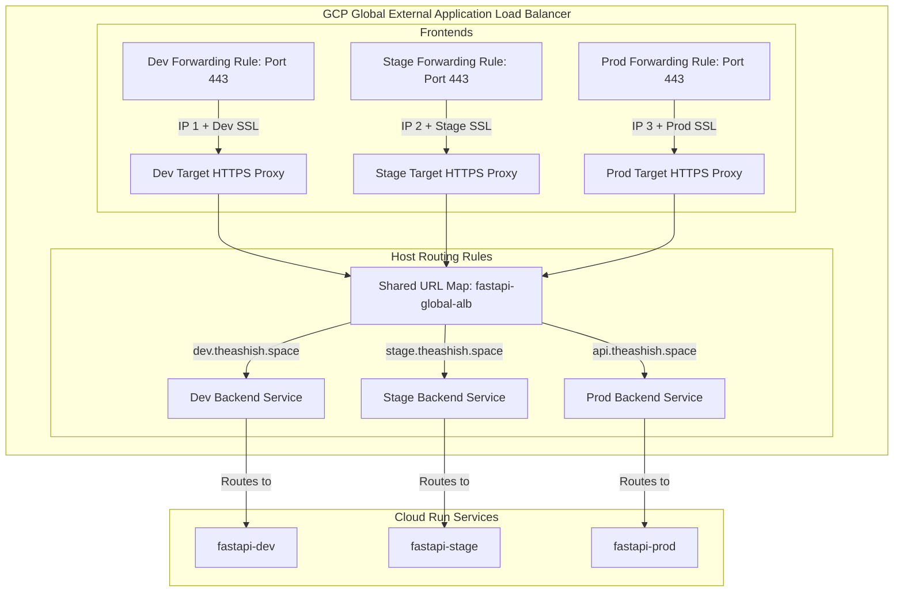

# Global Application Load Balancer & Custom Domain Setup

This guide explains how we route traffic to our multi-environment FastAPI services using a **single, shared Global External Application Load Balancer**.

---

## 🗺️ Shared Load Balancer Architecture

Rather than creating a separate GCP Load Balancer for each environment (which incurs significant hourly costs), we consolidate all environment deployments under a **single Global Application Load Balancer**. 

Here is how the routing and resource map is structured:



### Key Concepts:
1. **Shared URL Map**: The core "router" (URL Map) is shared across all environments (default name: `fastapi-global-alb`).
2. **Dedicated Static IPs & Google-Managed SSL Certs**: Every environment (Dev, Staging, Prod) gets its own reserved Global IP Address and Google-Managed SSL Certificate specific to its subdomain (e.g., `dev.theashish.space` vs `api.theashish.space`).
3. **Dedicated Target Proxies**: Each environment frontend binds its specific IP and SSL certificate to a unique Target HTTPS Proxy, which then forwards the traffic to the shared URL Map.
4. **Host-Based Routing (Host Rules & Path Matchers)**: The shared URL Map examines the request domain (the `Host` header) and routes it to the corresponding backend service using:
   - **Path Matchers**: Configures the default backend for the host.
   - **Host Rules**: Maps a specific host (e.g., `stage.theashish.space`) to its path matcher.

---

## 🛠️ Step-by-Step Load Balancer Setup Guide

We have created an interactive management script to manage your load balancers easily:

```bash
chmod +x scripts/gcp/setup-loadbalancer.sh
./scripts/gcp/setup-loadbalancer.sh
```

The script supports two primary operational paths:

### 1. Create Mode (Option 1)
Use this option when setting up your **first environment** (e.g. dev) to spin up the shared load balancer from scratch.
* **What it does**: Reserves a new Global IP, creates a Google-managed SSL Certificate, provisions a Serverless NEG & Backend Service, sets up the URL Map, creates the Port 443 HTTPS Frontend, and sets up a Port 80 HTTP-to-HTTPS redirect rule.
* **DNS Setup**: Point the subdomain (e.g. `dev.theashish.space`) to the reserved dev static IP via an **A Record** at your domain registrar.

---

### 2. View / Manage / Update Mode (Option 2)
Use this option to view details of your existing Load Balancer, deploy new environments under it, or update existing settings.

#### A. Interactive Analysis & Queries
Upon choosing **Option 2**, the script will:
- Query Google Cloud and list all existing Global URL Maps (Load Balancers) in your project, letting you select one by number.
- Query and display the live state of the selected Load Balancer:
  - **Existing Backend Services**: Lists all default and path-matcher backend services.
  - **Existing Host Rules**: Displays the host domain routing table (Host -> Path Matcher).
  - **Existing Frontends (HTTPS)**: Displays Target Proxies, associated Google-managed SSL Certificates, active Forwarding Rules, reserved IP addresses, and ports.

#### B. Actions Available
Once the active configuration is displayed, you can select one of the following operations:

* **Action 1: Add a new routing rule**
  Use this to deploy a new environment (e.g., staging or production) under the same Load Balancer. It will reserve a new static IP and SSL cert, create the backend service, attach the Serverless NEG, bind them to a new Target HTTPS Proxy, and register a new host rule mapping the subdomain (e.g. `stage.theashish.space`) to the new backend.
  
* **Action 2: Update/Replace SSL Certificate**
  Select this to update the Google-managed SSL certificate associated with a Target HTTPS Proxy. Useful when rotating domains or updating certificate boundaries.
  
* **Action 3: Set/Change Load Balancer default fallback backend service**
  Modifies the default fallback backend service of the entire URL Map (used for requests matching no host rules).
  
* **Action 4: Remove routing rules (Cleanup)**
  Removes a host rule and path matcher from the URL Map to decommission an environment's route.

---

## ⏳ SSL Activation & Testing
* **Google-managed SSL certificates** can take anywhere from **20 minutes to several hours** to provision and activate after the DNS record is updated.
* You can check the current SSL verification status in your GCP terminal:
  ```bash
  gcloud compute ssl-certificates describe fastapi-cert-[SERVICE_NAME] --global --format="get(managed.status)"
  ```
